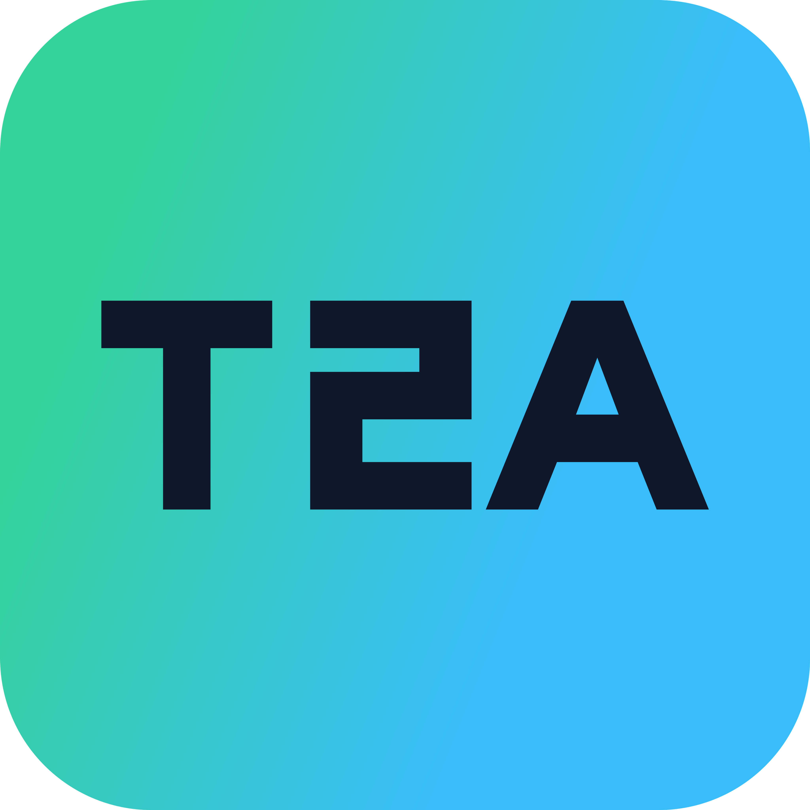

<p align="center"></p>

# TokenToAPI Connect

A simple local API configurator. Choose a gateway, pick Claude or Codex, enter your API Key, select the models you need, and import.

**v0.1.0 · Latest release** · [Download](https://github.com/TokenToAPI/TokenToAPI-connect/releases/tag/v0.1.0) · [Report an issue](https://github.com/TokenToAPI/TokenToAPI-connect/issues) · [MIT License](LICENSE)

## Download & usage

| Platform | Download | How to open |
| --- | --- | --- |
| macOS 11+ · Apple Silicon (arm64) | [macOS Apple Silicon ZIP](https://github.com/TokenToAPI/TokenToAPI-connect/releases/download/v0.1.0/TokenToAPI-Connect-0.1.0-macOS-arm64.zip) | Extract, then open `TokenToAPI Connect.app`; you can also move it to Applications |
| Windows 10/11 · x64 | [Windows x64 portable ZIP](https://github.com/TokenToAPI/TokenToAPI-connect/releases/download/v0.1.0/TokenToAPI-Connect-0.1.0-Windows-x64-portable.zip) | Extract the entire ZIP, then open `TokenToAPI Connect.exe` |

Downloads from the official website and this page both come directly from [GitHub Releases](https://github.com/TokenToAPI/TokenToAPI-connect/releases/tag/v0.1.0). The [SHA-256 checksums](https://github.com/TokenToAPI/TokenToAPI-connect/releases/download/v0.1.0/SHA256SUMS.txt) are also under the same release.

**Automated tests and artifact checks have all passed**; see [Verification notes](VERIFICATION.md) for the detailed scope.

No Node.js or Rust installation is required at runtime. The macOS package is for Apple Silicon Macs and uses an ad-hoc signature; it has not yet completed Apple Developer ID signing or notarization, so macOS may require confirmation before opening it. Windows uses the system WebView2 Runtime; if it is missing, install it from the [Microsoft website](https://developer.microsoft.com/microsoft-edge/webview2/) as prompted by the app. Checksums are in the release's `SHA256SUMS.txt`. The Windows portable package does not require installation or the VC++ Redistributable, but it is not yet publisher-signed, so Windows may show an unknown-publisher or SmartScreen warning.

### Download warning "Not a commonly downloaded file"

Browsers or the OS may show interception warnings such as "not a commonly downloaded file" for unsigned / unnotarized release packages. This is a routine file-reputation check and does not mean the file has been detected as malware. Keep your browser's protection settings enabled; if you cannot accept the trust status of the current release package, defer the installation or build it yourself after reviewing the source. If you encounter a different interception message, please provide the exact text via Issues and do not include your API Key.

### Configuration steps

1. **Choose a gateway**: [TokenToAPI](https://tokentoapi.com) is the default; you can also add your own site. Only one is used at a time.
2. **Choose a client**: pick Claude or Codex, then choose the desktop app, terminal, or VS Code extension.
3. **Enter your API Key**: click to fetch the available models, which reads the site's `/v1/models`.
4. **Select models and import**: choose the models you need, set the default model, and click Import.

After importing, fully quit the target client, then reopen it and start a new session. On Windows, Claude may remain in the system tray and must be quit from the tray menu.

To revert, click **Restore original configuration** in the top-right corner, choose the client, then click Restore. Even after importing repeatedly across multiple sites, the restore point from before the first import is preserved.

## Supported clients

| Client | Configuration method |
| --- | --- |
| Claude desktop app | A separate gateway profile for third-party inference mode, used for Chat, Cowork, and local Code |
| Claude Code terminal | API, default model, and available-model menu in the user `settings.json` |
| Claude Code · VS Code | The default user's extension settings, with Claude Code model settings synced |
| Codex desktop & terminal | Shared user configuration, API Key authentication, and the selected model catalog |

`CLAUDE_CONFIG_DIR` and `CODEX_HOME` are respected. The Windows build configures local Windows clients; WSL, Remote SSH, and custom VS Code profiles must be configured in their own environments.

The supported scope covers client versions that allow local API configuration, excluding the Claude web app, mobile clients, and cloud tasks. Claude Code 1.x does not support the new custom model menu; the Claude desktop app needs support for third-party inference mode. Organization-managed Claude providers and Codex with top-level custom profiles enabled block local import.

The gateway must expose `/v1/models` with Bearer authentication and support the Messages or Responses protocol of the target client. **Fetching the model list and writing configuration does not equal a verified conversation and tool calls.** Confirm in the target client after importing. See [VERIFICATION.md](VERIFICATION.md) for the test scope.

## Configuration & data

- API Keys never enter the site list, browser storage, or logs. After fetching the catalog, the key is kept only in the current process and cleared once the import succeeds; importing writes the local authentication configuration the selected client needs.
- Preserves MCP, permissions, hooks, unrelated settings, and TOML / JSONC comments within the supported scope.
- Automatically backs up before writing, using file locks, atomic replacement, and interrupted-operation recovery to avoid partially overwritten configuration.
- If you modify the configuration again after importing, restore asks for confirmation and keeps a copy of the current contents.
- The client is never reset without a restore record. Restoring only affects local files and cannot revalidate a login token the server has already invalidated.
- Restore records live in `.tokentoapi-connect` in the user directory and may contain original credentials; please do not upload them publicly. Newly written configuration files on macOS / Linux use `0600` permissions.

Codex's external model catalog replaces the built-in one. When the gateway provides full capability metadata, the selected entries are preserved; when only model names are provided, a conservative template is used, from which actual context length, vision, or tool capabilities cannot be inferred.

## Development & building

### Prerequisites (all platforms)

For development and local builds, install:

- Node.js 22 or newer (Node.js 24 recommended)
- pnpm 10
- Rust stable via [rustup](https://rustup.rs/)
- Git

Clone the repository, then install dependencies and run the checks:

```sh
git clone https://github.com/TokenToAPI/TokenToAPI-connect.git
cd TokenToAPI-connect
pnpm install --frozen-lockfile
pnpm dev
pnpm check
pnpm test:ui
pnpm test:core
```

`pnpm dev` starts the native Tauri development app. Use `pnpm dev:web` when you only need a browser preview; it does not modify local configuration.

### macOS

Install Xcode Command Line Tools (`xcode-select --install`). The documented release build targets Apple Silicon:

```sh
rustup target add aarch64-apple-darwin
pnpm build:macos
```

This produces the macOS arm64 ZIP in `release/`. Intel Macs can use `pnpm build` locally, but the current official release does not include an Intel package.

### Windows

On Windows 10/11 x64, install the Visual Studio C++ Build Tools with the Windows SDK, then run PowerShell:

```powershell
corepack enable
pnpm install --frozen-lockfile
pnpm build:windows
```

The portable ZIP is written to `release/`. The build machine needs Node.js, pnpm, Rust, MSVC, and the Windows SDK; end users only need the Windows WebView2 Runtime.

You can also cross-build the Windows package on macOS:

```sh
brew install llvm lld
cargo install --locked cargo-xwin
rustup target add x86_64-pc-windows-msvc
PATH="$(brew --prefix llvm)/bin:$PATH" XWIN_ARCH=x86_64 pnpm build:windows
```

### Linux

Build on the Linux distribution where the application will run (or a compatible build environment). For Debian/Ubuntu, install the Tauri/WebKitGTK development dependencies:

```sh
sudo apt update
sudo apt install -y \
  build-essential curl file libssl-dev \
  libgtk-3-dev libwebkit2gtk-4.1-dev \
  libayatana-appindicator3-dev librsvg2-dev patchelf
```

For Fedora:

```sh
sudo dnf install -y \
  gcc gcc-c++ make openssl-devel \
  gtk3-devel webkit2gtk4.1-devel \
  libappindicator-gtk3-devel librsvg2-devel patchelf
```

Then install the project dependencies and build the application:

```sh
pnpm install --frozen-lockfile
pnpm build
```

Tauri selects the bundles supported by the installed Linux tooling. Depending on the distribution and tools available, this can produce AppImage, `.deb`, and/or `.rpm` packages under `src-tauri/target/release/bundle/`. To request a specific bundle, use for example:

```sh
pnpm tauri build --bundles appimage
pnpm tauri build --bundles deb
pnpm tauri build --bundles rpm
```

Linux GUI packages should be built on Linux rather than cross-compiled from macOS or Windows. The official `v0.1.0` release currently provides macOS arm64 and Windows x64 packages; Linux users should build from source until a Linux release artifact is published.

### Packaging scripts

To package:

```sh
# macOS Apple Silicon ZIP (run on macOS)
rustup target add aarch64-apple-darwin
pnpm build:macos

# Windows x64 portable ZIP (run on Windows)
pnpm build:windows
```

Artifacts go to `release/`. The Windows script skips the installer and checks the EXE architecture, version, launch permissions, and DLL dependencies; CRT and WebView2Loader are statically linked, so users do not need to install the VC++ Redistributable separately. The Mac script verifies the app version, arm64 architecture, and ad-hoc signature.

`.cargo/config.toml` controls fully static CRT linking; `tauri.windows.conf.json` disables Tauri's own mixed-CRT override to avoid conflicts.

Releases are produced entirely locally and consume no cloud CI quota. The build scripts live in `scripts/` (`build-macos.mjs`, `build-windows-portable.mjs`), artifacts go to `release/`, and checksums are in `SHA256SUMS.txt`.

## Isolated testing

The Rust tests use a temporary user directory and fake keys. The native debug UI can use a separate test directory:

```sh
python3 scripts/mock-gateway.py
# In another terminal, using the built debug app:
TOKENTOAPI_CONNECT_TEST_HOME=/absolute/path/to/test-home src-tauri/target/debug/tokentoapi-connect
```

Add the site `http://127.0.0.1:18473` and enter the fake key `sk-local-fixture-only`. The mock gateway only returns the model catalog and never calls real models. The test directory override only takes effect in debug builds, and the UI shows test mode.

When reporting an issue, state the system, client version, and steps; do not upload API Keys, authentication files, or complete restore records.

## Open source & origins

Licensed under MIT, built on a trimmed configuration engine from [CC Switch](https://github.com/farion1231/cc-switch), retaining upstream copyright and license. Uses React, Tauri, and Rust; see [UPSTREAM.md](UPSTREAM.md) for origins and the trimming scope, and [licenses/](licenses/) for third-party licenses. This project is independently maintained and is not an official Claude or Codex client.
